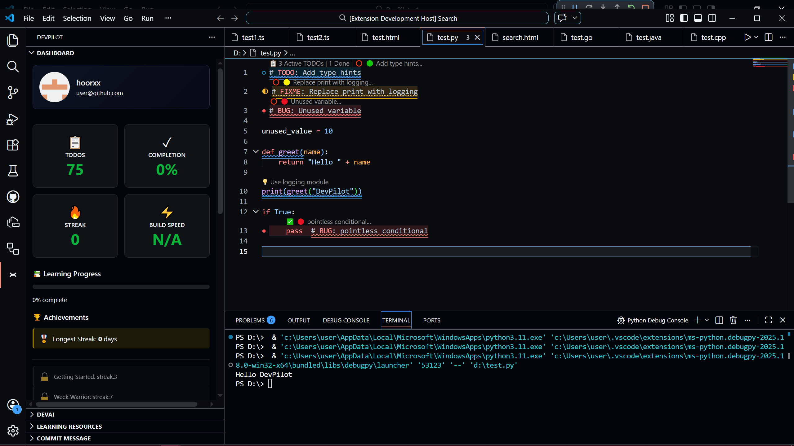
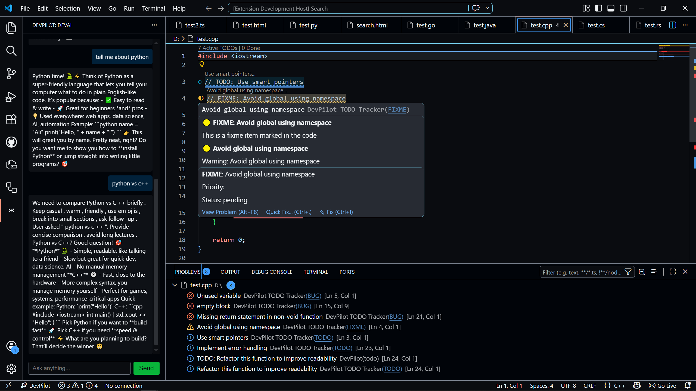
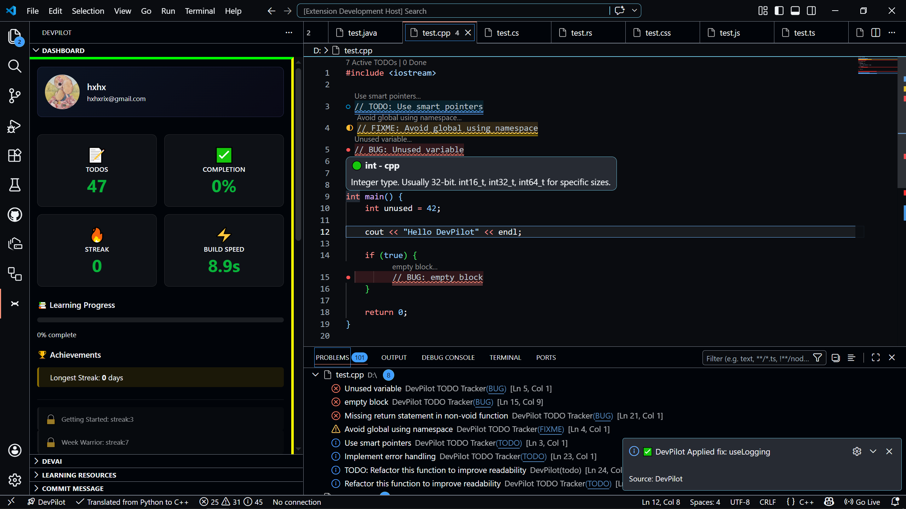
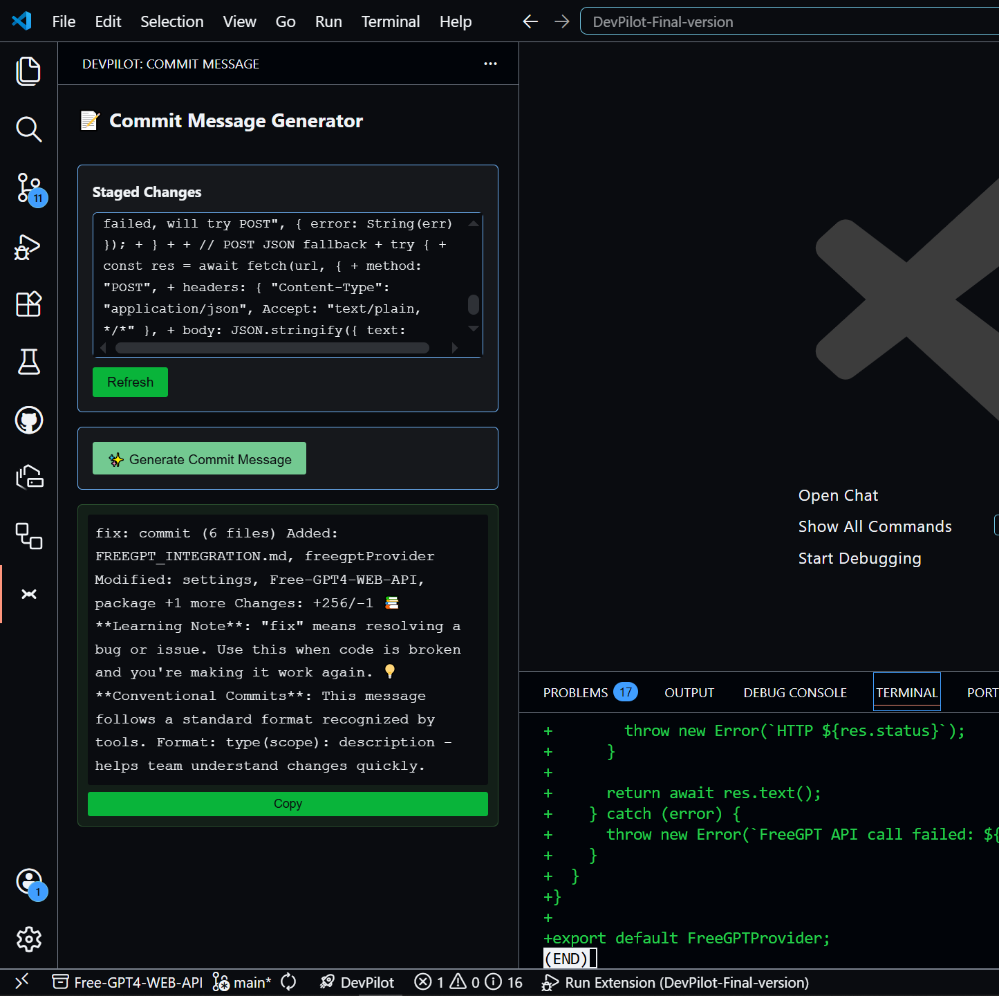
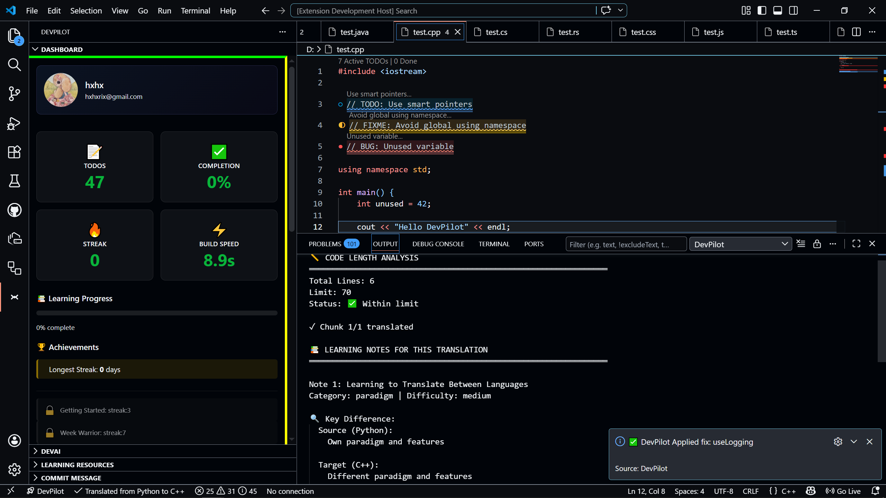
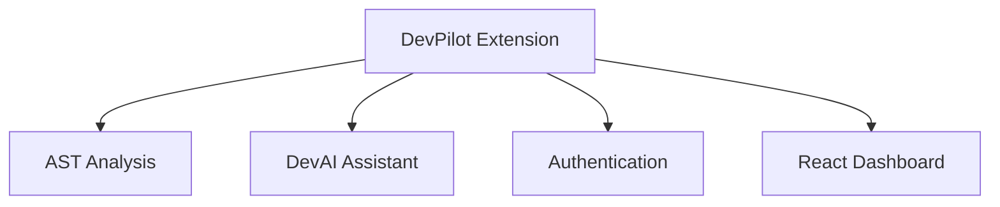

# 🚀 DevPilot

### AI‑Powered Development Assistant for Visual Studio Code

  

DevPilot is an offline‑first, AI‑enhanced development assistant built for Visual Studio Code. It combines AST‑powered code analysis, intelligent refactoring suggestions, workspace awareness, educational tools, authentication services, translation capabilities, productivity features, and optional AI integrations into a single developer‑focused platform.

---
 
💡 Learn, analyze, refactor, and improve code directly inside VS Code — even when offline.

## Why DevPilot?

Most AI coding tools focus on generating code. DevPilot focuses on helping developers understand, analyze, improve, and learn from code directly inside Visual Studio Code.

It combines offline AST‑powered analysis, educational tooling, productivity features, and optional AI assistance into a single integrated experience.

## 🎥 Quick Demo

Watch DevPilot in action:

[Project Demo](https://youtu.be/ocs4PCVTKS0)

---

| Dashboard | DevAI |
|-----------|-------|
|  |  |

| Hover | Git |
|--------|-----|
|  |  |

| Learning | Translation |
|----------|-------------|
|  |  |

---

## 📦 Latest Release

Version: **v0.1.3**

Released: June 2026

Includes:
- DevAI Assistant
- FreeGPT Integration
- Authentication System
- Translation Engine
- Learning Platform
- Dashboard Improvements
- Performance Optimizations

---

## 📥 Installation

👉 [Download Latest Release](https://github.com/hooryaa/DevPilot--Visual-Studio-Code-Extension-for-Beginner-Developers/releases/latest)

Install the latest VSIX via `Extensions: Install from VSIX...` in Visual Studio Code.

---

# ✨ Features (high level)

### Core Development
- AST analysis (symbol extraction, complexity, dependency analysis)
- Hover explanations and inline suggestions
- Structural error detection and refactoring recommendations

### AI Features
- DevAI assistant (context-aware help)
- Optional OpenAI integration
- Optional FreeGPT-compatible endpoints

### Productivity
- Git integration and commit message generation
- Todo tracker with workspace scanning and sync
- Progress / achievements tracking

### Learning
- Quiz runner and curated learning resources
- Contextual learning notes and explanations

---

## 🔍 Core Capabilities

- Deep AST analysis using Babel
- Offline‑first heuristics and pattern detectors
- Multi‑language support (JS/TS, Python, Go, Rust, Java, C#, C++, HTML/CSS)
- Secure auth: GitHub (native) + Google (loopback/worker)
- React dashboard webviews and lightweight editor providers

---

# 🏗 Architecture

---

# 📦 Project Overview

- ~100 TypeScript files
- React‑powered dashboard (webviews)
- Babel AST parsing + custom analyzers
- Offline‑first analysis with optional LLM augmentation
- OAuth authentication and secure token storage

---

## 📊 At a Glance

- 100+ TypeScript files
- Multi-language support
- Offline-first architecture
- React-powered dashboard
- AST-driven analysis engine
- AI-assisted development workflows

## 🏷 Technology Stack

- TypeScript, Node.js
- VS Code Extension API
- @babel/parser, @babel/traverse
- React, Radix UI, Tailwind CSS
- esbuild, Jest, ESLint, vsce
- Cloudflare Workers (optional OAuth worker)

---

## 📋 Requirements

- Visual Studio Code 1.104.0+
- Node.js 18+ (development only)

---

## 🚦 Project Status

Version: **v0.1.3**

Development: Active

---

## 🐛 Bug Reports & Feedback

Create issues and discussions on GitHub:

- [Issues](https://github.com/hooryaa/DevPilot--Visual-Studio-Code-Extension-for-Beginner-Developers/issues)
- [Discussions](https://github.com/hooryaa/DevPilot--Visual-Studio-Code-Extension-for-Beginner-Developers/discussions)

When filing an issue, include: description, steps to reproduce, expected vs actual behavior, and DevPilot version.

---

# 📜 License

Copyright (c) 2026 Hooria

The source code in this repository is licensed under the MIT License.

The DevPilot name, logo, branding, screenshots, documentation assets, and visual identity are not covered by the MIT License and may not be used without prior written permission.

See LICENSE and TRADEMARK.md for details.

---
# ⭐ Support DevPilot

If you find DevPilot useful:

- ⭐ Star the repository
- 📢 Share it with other developers
- 🚀 Follow future releases

---

Built with ❤️ for developers, learners, and creators.

