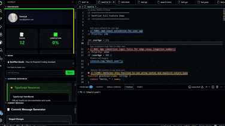
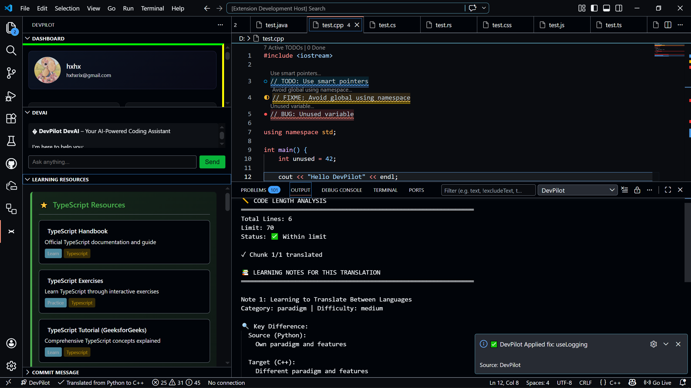
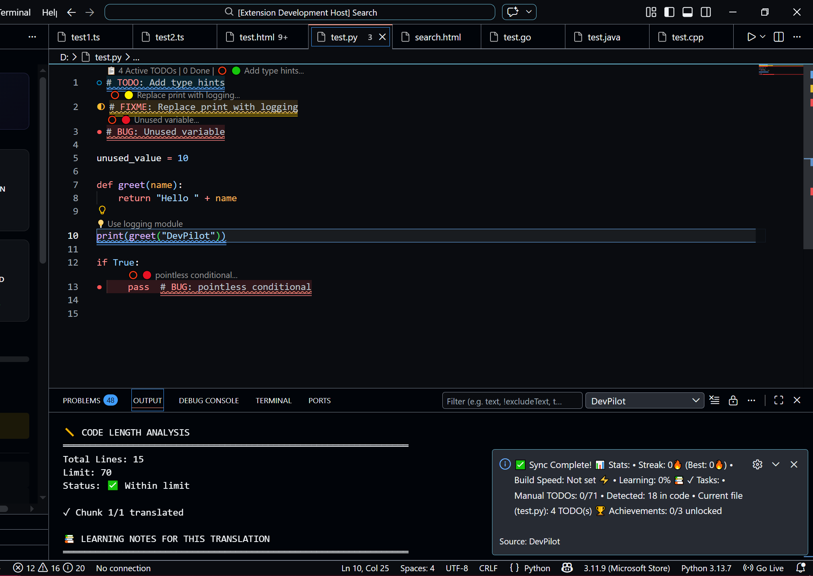
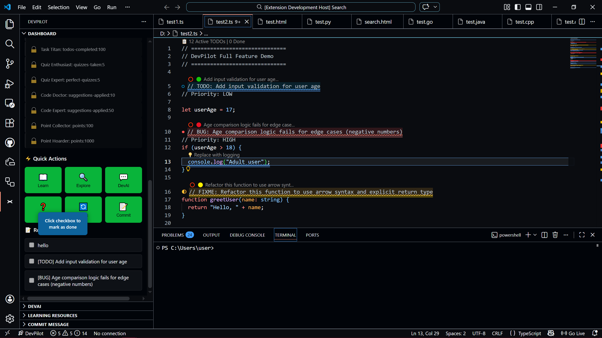
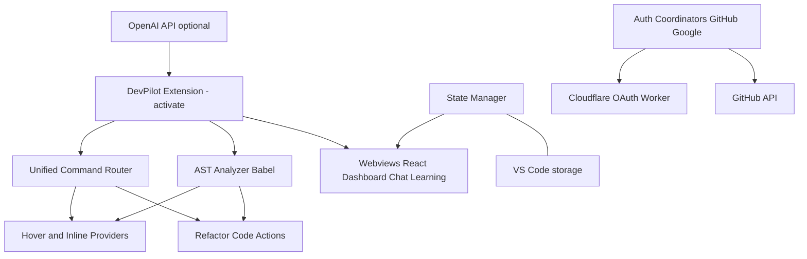

# 🚀 DevPilot

### Offline-first AI developer productivity suite for Visual Studio Code

  

DevPilot is an offline‑first, AI‑enhanced development assistant built for Visual Studio Code. It combines AST‑powered code analysis, intelligent refactoring suggestions, workspace awareness, educational tools, authentication services, translation capabilities, productivity features, and optional AI integrations into a single developer‑focused platform.

---
 
💡 Learn, analyze, refactor, and improve code directly inside VS Code — even when offline.

## Why DevPilot?

Most AI coding tools focus on generating code. DevPilot focuses on helping developers understand, analyze, improve, and learn from code directly inside Visual Studio Code.

It combines offline AST‑powered analysis, educational tooling, productivity features, and optional AI assistance into a single integrated experience.

## 🎥 Quick Demo

Watch DevPilot in action: [Project Demo (YouTube)](https://youtu.be/ocs4PCVTKS0)

---

| Dashboard (Github + Google Auth) | DevAI |
|-----------|-------|
|  |  |

| Hover Definitions & Suggestions | Git Commit Message Generation |
|--------|-----|
|  |  |

| Learning Resources | Translation & Tips |
|----------|-------------|
|  |  |

---

## More Screenshots

| Streak & Progress | Todo Sync |
|-------------------|-----------|
|  |  |

---

## 📦 Latest Release

Version: **v1.0.0**

Released: July 2026

Includes:
- AI chat, code explanations, and refactoring suggestions
- Offline AST-based analysis and hover insights
- Git commit generation and review support
- Learning resources, TODO tracking, and developer workflow tools
- Optional OpenAI, Gemini, or local FreeGPT support

---

## AI Providers

DevPilot works with multiple AI backends. You can choose the provider that matches your privacy and workflow needs:

- **OpenAI** — cloud-based completions and chat.
- **Gemini** — Google-backed alternative for completions and chat.
- **Local (FreeGPT)** — self-hosted FreeGPT-compatible endpoints for offline-first usage.

If you prefer not to use any cloud AI provider, DevPilot's offline analysis, AST inspection, TODO management, learning resources, and many productivity features continue to work without an API key.

---

# 📥 Installation

### 🛒 Install from Visual Studio Marketplace

The easiest way to install DevPilot is directly from the official Visual Studio Marketplace.

👉 **Install DevPilot AI**  
https://marketplace.visualstudio.com/items?itemName=devpilotorg.devpilot-ai-assistant-hooria

Or search for **"DevPilot AI"** directly in the VS Code Extensions Marketplace.

### 📦 Manual Installation (VSIX)

If you prefer installing manually or want a specific release, download the latest VSIX from GitHub:

👉 https://github.com/hooryaa/DevPilot--Visual-Studio-Code-Extension-for-Beginner-Developers/releases/latest

Then install it from within Visual Studio Code:

`Extensions → Install from VSIX...`

---

# ✨ Features (High Level)

### Core Development
- AST analysis (symbol extraction, complexity, dependency analysis)
- Hover explanations and inline suggestions
- Structural error detection and refactoring recommendations

### AI Features
- DevAI assistant (context-aware help)
- Optional OpenAI and Gemini integration
- Optional FreeGPT-compatible endpoints

### Productivity
- Git integration and commit message generation
- Todo tracker with workspace scanning and sync
- Progress / achievements tracking

### Learning
- Quiz runner and curated learning resources
- Contextual learning notes and explanations

---

## 🔍 Core Capabilities

- Deep AST analysis using Babel
- Offline‑first heuristics and pattern detectors
- Multi‑language support (JS/TS, Python, Go, Rust, Java, C#, C++, HTML/CSS)
- Secure auth: GitHub (native) + Google (loopback/worker)
- React dashboard webviews and lightweight editor providers

---

# 🏗 Architecture

---

# 📦 Project Overview

- ~100 TypeScript files
- React‑powered dashboard (webviews)
- Babel AST parsing + custom analyzers
- Offline‑first analysis with optional LLM augmentation
- OAuth authentication and secure token storage

---

## 📊 At a Glance

- 100+ TypeScript files
- Multi-language support
- Offline-first architecture
- React-powered dashboard
- AST-driven analysis engine
- AI-assisted development workflows

## 🏷 Technology Stack

- TypeScript, Node.js
- VS Code Extension API
- @babel/parser, @babel/traverse
- React, Radix UI, Tailwind CSS
- esbuild, Jest, ESLint, vsce
- Cloudflare Workers (optional OAuth worker)

---

## 📋 Requirements

- Visual Studio Code 1.104.0+
- Node.js 18+ (development only)

---

## 🚦 Project Status

Version: **v1.0.0**

Development: Active

---

## 🐛 Bug Reports & Feedback

Create issues and discussions on GitHub:

- [Issues](https://github.com/hooryaa/DevPilot--Visual-Studio-Code-Extension-for-Beginner-Developers/issues)
- [Discussions](https://github.com/hooryaa/DevPilot--Visual-Studio-Code-Extension-for-Beginner-Developers/discussions)

When filing an issue, include: description, steps to reproduce, expected vs actual behavior, and DevPilot version.

For privacy and data handling details, see [docs/PRIVACY_POLICY.md](docs/PRIVACY_POLICY.md).

---

# 📜 License

Copyright (c) 2026 Hooria

The source code in this repository is licensed under the MIT License.

The DevPilot name, logo, branding, screenshots, documentation assets, and visual identity are not covered by the MIT License and may not be used without prior written permission.

See [LICENSE](LICENSE) and [TRADEMARK.md](TRADEMARK.md) for details.

---
# ⭐ Support DevPilot

If you find DevPilot useful:

- ⭐ Star the repository
- 📢 Share it with other developers
- 🚀 Follow future releases

---

Built with ❤️ for developers, learners, and creators.

